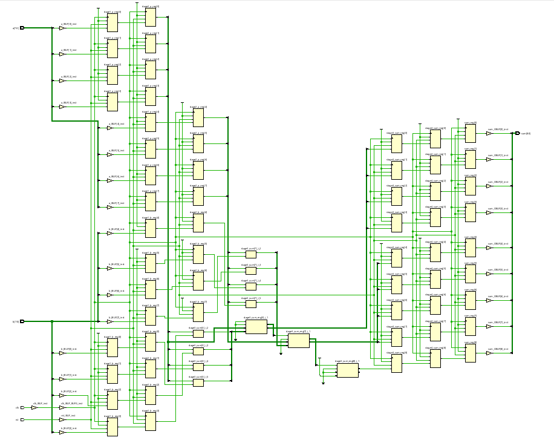

# 🏗️ 5-Stage Pipelined Adder (Verilog)

This repository contains a simple 5-stage pipelined adder implemented in Verilog, along with a testbench and key simulation images.  
The project is suitable for beginners learning pipelining and digital simulation.

---

## Table of Contents

- [Files](#files)
- [How it Works](#how-it-works)
- [Usage](#usage)
- [Output Verification](#output-verification)
- [References](#references)
- [License](#license)
- [Contact](#contact)

---

## Files

- `Pipe.v` — Verilog module for the 5-stage pipelined adder
- `Pipetb.v` — Testbench for `Pipe.v`
- `RTL_schematic.png` — RTL schematic after synthesis
- `Technological_schematic.png` — Technology-level schematic/netlist
- `waveform.png` — Output simulation waveform

---

## How it Works

- The design is structured as a **5-stage pipeline**. On every clock edge, input values move forward through registers and the sum is computed.
- Due to pipelining, the output sum appears after 5 clock cycles (latency), demonstrating increased throughput—a key concept in digital design.

---

## Usage

1. Add `Pipe.v` and `Pipetb.v` to your HDL simulator (Vivado, ModelSim, etc.).
2. Set `Pipetb.v` as the simulation top.
3. Synthesize to generate schematics, and run simulation for waveform verification.

---

## Output Verification

**Simulation Waveform**  


- Sums of input pairs should appear after five clock cycles (the pipeline delay).
- Example: input A=3, B=4. The output sum=7 appears five cycles after those values are applied.

**Schematic Visuals**  
-   
  *RTL-level schematic after synthesis*

-   
  *Technology (netlist) schematic, showing actual hardware resources*

---

## References

- [`Pipe.v`](Pipe.v) — 5-stage pipeline adder (main Verilog source)
- [`Pipetb.v`](Pipetb.v) — Testbench
- [NPTEL: Digital Design (EE180)](https://onlinecourses.nptel.ac.in/noc25_ee180/preview) — Basic digital logic+HDL course
- [Pipeline (computing) - Wikipedia](https://en.wikipedia.org/wiki/Pipeline_(computing))
- [An Intro to Basic FPGA Pipelining](https://resources.altium.com/p/intro-basic-fpga-pipelining) — Fast hardware pipelining intro

---

## License

This project is licensed under the [MIT License](LICENSE).

---

## Contact

- **LinkedIn:** [Tejas R Mallah](https://www.linkedin.com/posts/tejas-r-mallah-28052b283_verilog-digitaldesign-vlsi-activity-7365287507430719489-yYqz?utm_source=share&utm_medium=member_desktop&rcm=ACoAAET0mcABoSmVvowkUz7qcSZkG2bhRVZnDQ4)
- **Email:** tejasmallah@gmail.com

---

_Designed for learning, demonstration, and screening. Always open to questions, feedback, and collaboration!_

```
#Verilog #Pipelining #FPGA #DigitalDesign #Adder #Testbench #RTL #EDA
```
